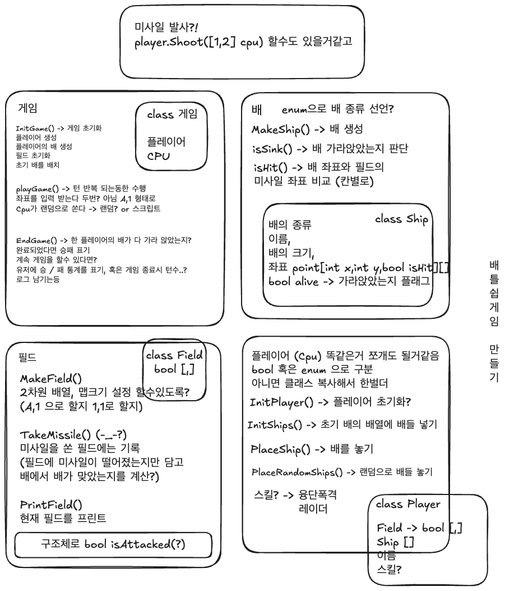
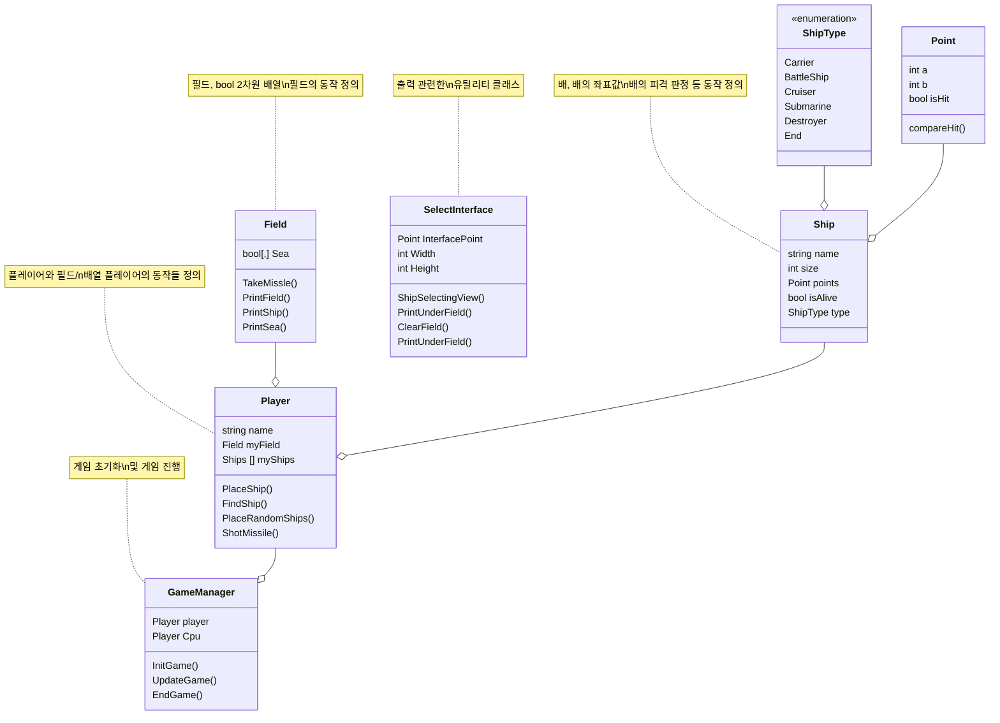

# BattleShip
 

## 클래스 다이어그램 지원하는지 확인

# 변경사항!!!

## Ship.cs
* 배의 isSink 삭제
  * private DoSink로 변경, isHit 할때 호출해서 배 가라앉히고 침몰 텍스트 프린트. (한번만 호출)
* 배의 포인터 인덱스로 세팅하는 메서드 추가
  * SetPointByIndex 추가

---

## Player.cs 
* internal -> public 으로 변경

## 건의 / 제안
* 있나유..?
* 12/12
* Field 클래스 내부에서 PrintField 메서드가 배가 아에 없는 상황에서 터져 버립니다.
* 아무래도 저 조건문 부분 수정해야 할듯합니다. 일단 주석처리후 임의로 수정하겠습니다.
* 수정한 코드랑 이전 코드랑 어떻게 합칠지는 내일 상의해보고 싶습니다.

## 해야할것들
* 필드 만들기
  * 필드 프린트, 배모양 가로 세로인지 판별 메서드
  * 가로일때는 ◁ ◀ □ ■ ▶ ▷
  * 세로일때는 △ ▲ □ ■ ▼ ▽
  * 바다 표시는 ∼, 맞았으면 ♨ / 완성형으로 가자면..?
    * // 데모
  Console.WriteLine("∼ ◀ □ ■ ▶ ∼ ∼ ∼");
  Console.WriteLine("∼ △ ∼ ∼ ∼ ∼ ♨ ∼");
  Console.WriteLine("∼ □ ∼ ∼ ∼ ∼ ∼ ∼");
  Console.WriteLine("∼ □ ∼ ∼ ∼ ∼ ∼ ∼");
  Console.WriteLine("∼ ▼ ∼ ∼ ∼ ∼ ∼ ∼ ");
  * 이런 느낌적인 느낌으로..
